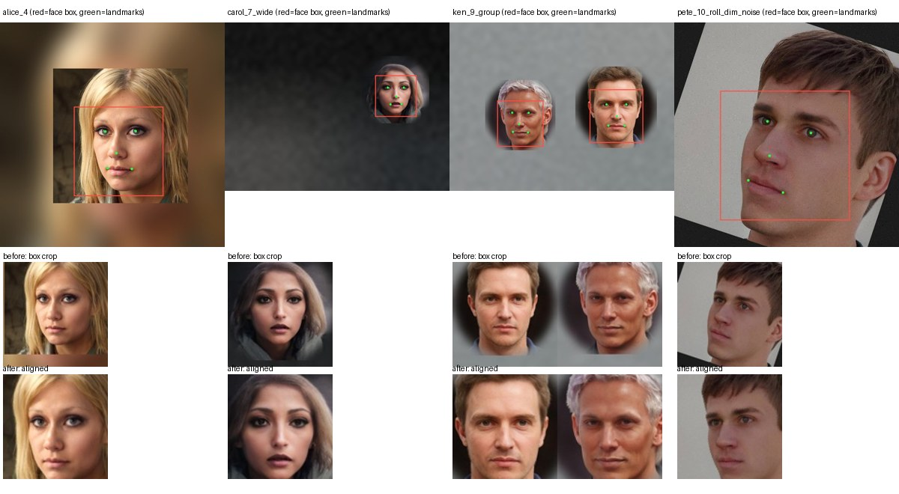

# Face detection & matching: evidence

Branch `claude/face-matching`. Starting point: threshold 15 on raw Euclidean distance, padded-box crops, one 1024px Vision pass.
All numbers below are reproducible; commands are at the bottom.

## What changed

| | Before | After |
|---|---|---|
| Crop fed to MobileFaceNet | Vision face box + 25% padding, squashed to 112x112 | Eyes/nose/mouth warped onto the ArcFace 112x112 template (what the model was trained on). Box crop only as fallback |
| Distance | Euclidean on raw (unnormalized) embeddings, threshold 15 | Cosine distance (1 - cos), threshold 0.55 |
| Small faces in wide shots | Vision misses faces under ~5% of the frame; photos were squeezed to 1024px first | Image pyramid of overlapping 1024px tiles (1024 / 2048 / native), duplicates merged, landmarks re-detected on a crop of each face |
| Unalignable faces | n/a (nothing was aligned) | Fall back to box crop, but must be 0.2 closer to match (`unalignedPenalty`) |
| Stored embeddings | `face_enrollment_v2_*` | `face_enrollment_v3_*` (v2 vectors are not comparable, so friends show as "not enrolled" until re-enrolled) |

## Results

### Real photos (LFW: 70 identities, 3 reference photos each, 261 probe photos, 18,009 wrong-person pairs)

LFW is the only real-photo data in this evaluation: same-person photos differ in pose, light, expression and age. It is not committed (see `scripts/verify/make_lfw_eval.py`).

| Pipeline | Recall @ shipping threshold | False matches @ shipping threshold | AUC | Recall at 0.1% false-match rate |
|---|---|---|---|---|
| Before (box crop, Euclidean, 15) | 195/261 = 74.7% | **328 / 18,009 (1.8%)** | 0.979 | 25.7% |
| Alignment only (still Euclidean, 15) | 9/261 = 3.4% | 0 | 0.998 | 46.4% |
| Cosine only (box crop) | n/a | n/a | 0.982 | 62.1% |
| **After (aligned, cosine, 0.55)** | **249/261 = 95.4%** | **0 / 18,009** | **1.000** | **100%** |

After: same-person distances p50 0.36, p95 0.53, max 0.64; closest wrong-person pair 0.66. Threshold 0.55 leaves a 0.11 margin to the nearest wrong person; at 0.60 recall would be 99% and the margin 0.06. I kept the conservative end (spec: prefer a miss to a wrong share).

Why raw Euclidean could not be rescued by alignment alone: the model's output length varies with image quality, so after alignment the old threshold of 15 sat far below real same-person distances (median 20). Cosine ignores length.

### Synthetic fixture set (16 AI-generated identities, 98 probe photos, 114 same-person pairs, 1,454 wrong-person pairs)

| | Recall | False matches | Same-person max | Wrong-person min |
|---|---|---|---|---|
| Before | 25/114 = 21.9% | 0 | 24.8 | 17.7 |
| After | **114/114 = 100%** | **0 / 1,454** | 0.061 | 0.636 |

Per kind, before -> after: group shots (2 people) 0/32 -> 32/32, wide shot 0/16 -> 16/16, tiny face 0/16 -> 16/16, roll+dim+noise 8/16 -> 16/16, "normal" photos (including the 16 with a small face pasted into a larger scene) 16/32 -> 32/32, 4032px frame 0/1 -> 1/1.

### Small faces in big photos (8 identities, 4032x3024 frames, head width 50/80/120/200 px)

| Head width in frame | Single 1024px pass (old approach) | Pyramid |
|---|---|---|
| 200 px (5%) | 8/8 | 8/8 |
| 120 px (3%) | 4/8 | 8/8 |
| 80 px (2%) | 0/8 | **8/8** |
| 50 px (1.2%) | 0/8 | 0/8 |

Detecting at full 4032px in one pass does not fix it (80px: 1/8), Vision's detector needs the face to be a few percent of whatever image it is given, which is why tiles help. Heads under about 70px in a 12 MP frame are still missed.

## What this does and doesn't prove

- **Synthetic fixtures** are augmented variants of one AI-generated portrait per identity (pose/zoom/light/blur/JPEG, pasted into scenes). They show the detector and aligner cope with scale, roll, dimness and crowding. They say almost nothing about identity variation: same-person distances are tiny (0.01-0.06) because it is literally the same face. **Do not tune the threshold on them.**
- **LFW** supplies real identity variation but is easy: celebrities, mostly frontal, good light, 250px crops. Phone photos of friends (kids, hats, night, motion blur, profile) are harder, so expect lower recall at 0.55 and a smaller margin than 0.11. LFW also says nothing about detection at wide-shot sizes.
- **Vision landmarks do not work in the iOS Simulator** (they come back collapsed). `FaceAligner.plausible` rejects them and the Simulator takes the box-crop fallback, so `make test-unit` (Simulator) exercises that fallback and the 0.2 penalty, not alignment. The aligned pipeline is measured on the Mac (`scripts/verify/facematch-mac.sh`, real Vision + CoreML on the same source files). It has not been run on a physical iPhone; Vision on a phone should behave like the Mac's, but that is unverified.
- Enrollment and probe photos in the fixtures share lighting/background statistics more than real life does; LFW is the better guide to the threshold.
- The threshold is still a guess about the long tail. A real test needs a few hundred real photos of real friends, which this repo doesn't have (and the app's privacy rules rule out uploading them).

## Reproduce

```bash
scripts/verify/facematch-mac.sh --min-recall 114        # synthetic fixtures, real Vision on the Mac, ~10 s idle machine; gates 0 false + recall
make test-unit                                          # Simulator XCTests (box-crop fallback path), under the shared sim lock
python3 scripts/verify/make_lfw_eval.py /tmp/lfw-eval   # real photos (downloads ~470 small JPEGs from Hugging Face)
OUT=verification-output/lfw scripts/verify/facematch-mac.sh /tmp/lfw-eval --dump-embeddings   # then:
python3 scripts/verify/analyze_embeddings.py /tmp/lfw-eval verification-output/lfw/embeddings.json
python3 scripts/verify/make_scale_probes.py /tmp/scale  # head-size stress set (~11 MB, not committed)
# "before" numbers: SWIFT_FLAGS="-D FACEMATCH_ABLATE_BOX -D FACEMATCH_ABLATE_EUCLID" OUT=verification-output/before scripts/verify/facematch-mac.sh
```



Top row: Vision box (red) and landmarks (green) on the probe. Middle: the 112x112 crop the model used before. Bottom: after (the rolled face is upright, the pasted-scene edge is gone, scale is consistent).

`baseline-report.txt` is the original Simulator report on the widened fixtures (24.6% recall).
